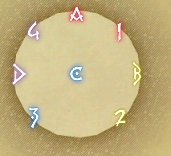
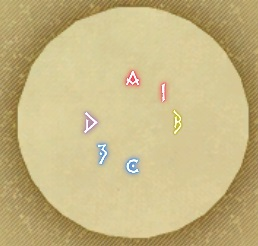
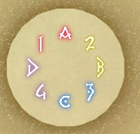
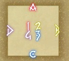
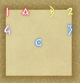

# Endwalker-ExtremeTrials


## The Endsinger



```json
{"Name":"Imported","MapID":846,"A":{"X":100.0,"Y":0.0,"Z":81.5,"ID":0,"Active":true},"B":{"X":118.5,"Y":0.0,"Z":100.0,"ID":1,"Active":true},"C":{"X":100.0,"Y":0.0,"Z":100.0,"ID":2,"Active":true},"D":{"X":81.5,"Y":0.0,"Z":100.0,"ID":3,"Active":true},"One":{"X":113.435,"Y":0.0,"Z":86.564,"ID":4,"Active":true},"Two":{"X":113.435,"Y":0.0,"Z":113.435,"ID":5,"Active":true},"Three":{"X":86.564,"Y":0.0,"Z":113.435,"ID":6,"Active":true},"Four":{"X":86.564,"Y":0.0,"Z":86.564,"ID":7,"Active":true}}
```

## Barbariccia




```json
{"Name":"Imported","MapID":871,"A":{"X":100.0,"Y":0.0,"Z":92.5,"ID":0,"Active":true},"B":{"X":107.5,"Y":0.0,"Z":100.0,"ID":1,"Active":true},"C":{"X":100.0,"Y":0.0,"Z":107.5,"ID":2,"Active":true},"D":{"X":92.5,"Y":0.0,"Z":100.0,"ID":3,"Active":true},"One":{"X":105.3,"Y":0.0,"Z":94.696,"ID":4,"Active":true},"Two":{"X":0.0,"Y":0.0,"Z":0.0,"ID":5,"Active":false},"Three":{"X":94.696,"Y":0.0,"Z":105.3,"ID":6,"Active":true},"Four":{"X":0.0,"Y":0.0,"Z":0.0,"ID":7,"Active":false}}
```

## Rubicante




```json
{"Name":"Imported","MapID":924,"A":{"X":100.0,"Y":0.0,"Z":88.5,"ID":0,"Active":true},"B":{"X":111.5,"Y":0.0,"Z":100.0,"ID":1,"Active":true},"C":{"X":100.0,"Y":0.0,"Z":111.5,"ID":2,"Active":true},"D":{"X":88.5,"Y":0.0,"Z":100.0,"ID":3,"Active":true},"One":{"X":91.868,"Y":0.0,"Z":91.868,"ID":4,"Active":true},"Two":{"X":108.131,"Y":0.0,"Z":91.868,"ID":5,"Active":true},"Three":{"X":108.131,"Y":0.0,"Z":108.131,"ID":6,"Active":true},"Four":{"X":91.868,"Y":0.0,"Z":108.131,"ID":7,"Active":true}}
```

## The Voidcast Dais




```json
{"Name":"Imported","MapID":950,"A":{"X":99.968,"Y":0.029,"Z":86.151,"ID":0,"Active":true},"B":{"X":114.023,"Y":0.03,"Z":99.854,"ID":1,"Active":true},"C":{"X":99.916,"Y":0.029,"Z":113.893,"ID":2,"Active":true},"D":{"X":85.854,"Y":0.03,"Z":99.784,"ID":3,"Active":true},"One":{"X":97.236,"Y":0.03,"Z":97.213,"ID":4,"Active":true},"Two":{"X":102.755,"Y":0.03,"Z":97.236,"ID":5,"Active":true},"Three":{"X":102.664,"Y":0.03,"Z":102.676,"ID":6,"Active":true},"Four":{"X":97.184,"Y":0.029,"Z":102.615,"ID":7,"Active":true}}
```

## The Abyssal Fracture



```json
{"Name":"Imported","MapID":965,"A":{"X":92.09,"Y":0.0,"Z":81.309,"ID":0,"Active":true},"B":{"X":107.906,"Y":0.0,"Z":81.276,"ID":1,"Active":true},"C":{"X":100.053,"Y":0.0,"Z":99.98,"ID":2,"Active":true},"D":{"X":0.0,"Y":0.0,"Z":0.0,"ID":3,"Active":false},"One":{"X":81.123,"Y":0.0,"Z":81.106,"ID":4,"Active":true},"Two":{"X":118.899,"Y":0.0,"Z":81.096,"ID":5,"Active":true},"Three":{"X":118.846,"Y":0.0,"Z":92.094,"ID":6,"Active":true},"Four":{"X":81.007,"Y":0.0,"Z":92.1,"ID":7,"Active":true}}
```