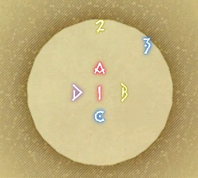
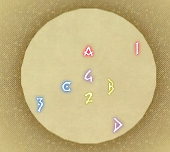

# The Weapon's Refrain



```
{"Name":"Imported","MapID":539,"A":{"X":100.0,"Y":0.0,"Z":93.5,"ID":0,"Active":true},"B":{"X":106.5,"Y":0.0,"Z":100.0,"ID":1,"Active":true},"C":{"X":100.0,"Y":0.0,"Z":106.50013,"ID":2,"Active":true},"D":{"X":93.50011,"Y":0.0,"Z":100.0,"ID":3,"Active":true},"One":{"X":100.0,"Y":0.0,"Z":100.0,"ID":4,"Active":true},"Two":{"X":112.728,"Y":0.0,"Z":87.272,"ID":5,"Active":true},"Three":{"X":86.5,"Y":0.0,"Z":100.0,"ID":6,"Active":true},"Four":{"X":100.0,"Y":0.0,"Z":82.0,"ID":7,"Active":true}}
```

# The unending coil of bahamud

## asellog(H3)



```
{"Name":"asellog(H3) marker","MapID":280,"A":{"X":0.0,"Y":0.0,"Z":-9.0,"ID":0,"Active":true},"B":{"X":8.0,"Y":0.0,"Z":4.0,"ID":1,"Active":true},"C":{"X":-8.0,"Y":0.0,"Z":4.0,"ID":2,"Active":true},"D":{"X":10.35,"Y":0.0,"Z":17.927,"ID":3,"Active":true},"One":{"X":17.927,"Y":0.0,"Z":-10.35,"ID":4,"Active":true},"Two":{"X":0.0,"Y":0.0,"Z":8.0,"ID":5,"Active":true},"Three":{"X":-17.927,"Y":0.0,"Z":10.35,"ID":6,"Active":true},"Four":{"X":0.0,"Y":0.0,"Z":0.0,"ID":7,"Active":true}}
```
